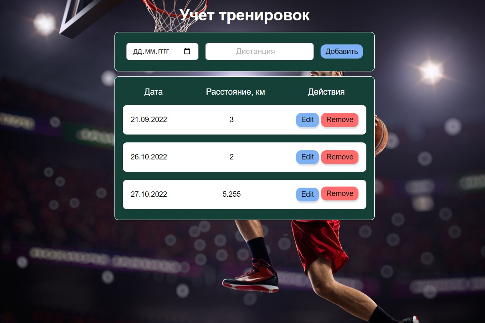

Учёт тренировок
===

Небольшое приложение, которое хранит данные о тренировках (прогулках).

Общий интерфейс выглядит следующим образом:

## Добавление данных

В поле ввода вводится дата и количество пройденных километров. Добавленные значения добавляются в таблицу по кнопке "Добавить" или клавише "Enter".

_Особенности добавления_:
1. Новые значения добавляются не в конец, а согласно сортировке по дате, т.е. если мы добавим 21.07.2022, то значение встанет на первую позицию, а если 17.07.2022 - то на последнюю.
2. Если мы добавляем значения, указывая уже существующую дату, то значения суммируются с теми, что хранятся в таблице.

## Удаление данных

С помощью иконки "Remove" удаляется вся строка целиком и данные, связанные с ней.

## Редактирование данных

С помощью иконки "Edit" происходит редактирование данных.